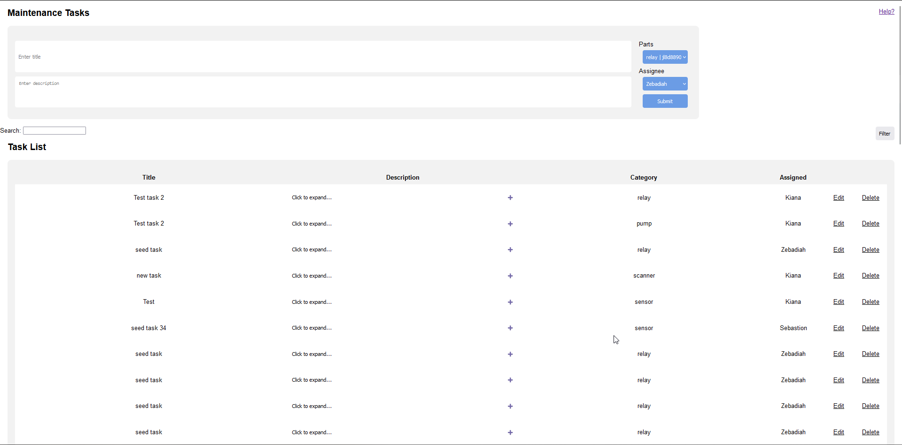

# Task System

This is a custom task system for managing hardward-related tasks among a group of users. Features include:
 - Searching for tasks
 - Adding new tasks
 - Dynamically loading tasks
 - Updating task list
 - Responsive design
 - REST compliant



## Documentation

### How to use
To compile, you must be within a docker container. To first pull the docker container to update/install it onto your host system, use the following command: `docker pull sebouellette/webserver:shoppingcart`

To enter the docker container, find startup.txt in the Shared folder. This file contains the commands to start the docker instance on different types of terminals. 

Once you are within the docker container terminal, enter the `/Shared` directory using the `cd` command. Here, you can run the `./recompile.sh` command to recompile the project. The executable will be placed in the newly created `build` folder. If a build folder already exists, it will be deleted and a new one will be created while compiling. 

If you only wish to compile without clearing out the current build, you can `cd build`, then use `make` to compile changes quickly. 

To use the compiled executable, simply start it using the following comamnd `/Shared/build/tasksystem`.

### Legend
`<hello>` -- Text surrounded by <> is a variable. Do not include <> when using the API.<br>
`?foobar?` -- Text surrounded by ?? is content that is to be decided later in development. 


### View home page
`GET` `http://localhost:8080/`<br>
**Result:** `text/html`

### View Help page
`GET` `/help`<br>
**Result:** `text/html`

### Edit Task
`GET` `/editor`<br>
**Querystring Parameters:** `?id=<task_id>`<br>
**Result:** `text/html`

### Search list of tasks
`GET` `/search`<br>
**Querystring Parameters:** `?key=<search_string>`<br>
**Result:** `application/json`<br>
-> The provided search string is matched against the task title and description then returns an array of all matching tasks

### Find specific task
`GET` `/edit`<br>
**Querystring Parameters:** `?id=<task_id>`<br>
**Result:** `application/json`

### Edit specific task
`PATCH` `/edit`<br>
Request body format: `application/json`
```json
{
    "id": <task_id> // required field
}
```
**Result:** `N/A`

### Add new task
`POST` `/add`
Request body format: `application.json`
```json
{
    "title": "<task_title>", // required
    "description": "<task_description>", // required
    "partid": <part_id>, // required
    "assigned": <assigned_user_id>, // required
}
```
If a task with this partid and assigned user id already exists, status code `409 Conflict` will be returned. When this result is given, the client must instead perform a PUT request to /add to replace the existing task.

### Replace existing task
`PUT` `/add`
Request body format: `application.json`
```json
{
    "title": "<task_title>", // required
    "description": "<task_description>", // required
    "partid": <part_id>, // required
    "assigned": <assigned_user_id>, // required
}
```

### Delete specific task
`GET` `/delete`<br>
**Querystring Parameters:** `?id=<task_id>`<br>
**Result:** `N/A`

### Find allowed methods
`OPTIONS` `*`